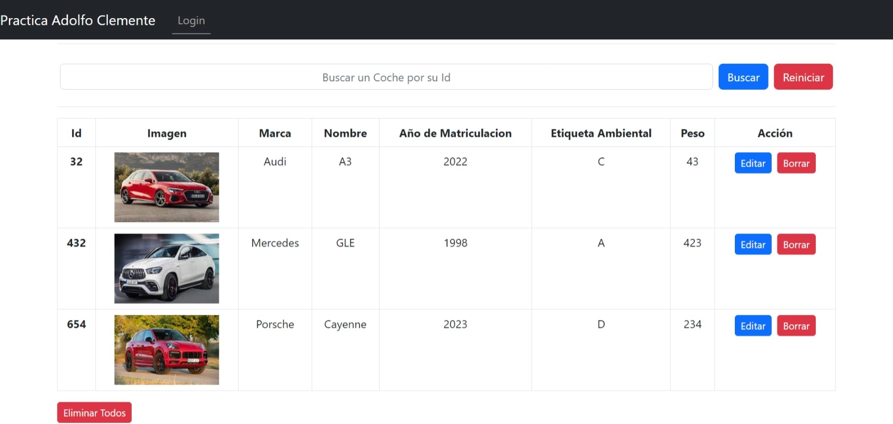

# Practica de Adolfo Clemente Palacios

### La practica se basa en una API REST que implementa todos los servicios CRUD que trabaja con datos de coches y tiene un LogIn con gestión de token JWT de autenticación.

---

## Software requerido 

            
| Nombre | Version
|--------|------
| NodeJs | 18.4.0
|NPM | 9.4.2
| Angular CLI | 15.1.5
| PostgreSQL DB | 12.3

       

---
<h2 style="text-align: center"> Servidor (Backend) </h2>

> **Todo el servidor a sido construdio con Typescript**    
> Paquetes que se han utilizado para crear el servidor:
> 1. @tpes/Express
> 2. TypeORM
> 3. @types/dotenv
> 4. nodemon
> 5. @types/cors
> 6. @types/jsonwebtoken
> 7. @types/bcryptjs       

---

<h2 style="text-align: center">Cliente (Frontend) </h2>

> **La parte frontal se ha creado con Angular**    
> Paquetes que se han utilizado para crear el servidor:
> 1. @angular/common
> 1. @angular/compile
> 1. @angular/core
> 1. @angular/form
> 1. @angular/route
> 1. @popperjs/cor
> 1. boostrap
> 1. bootstrap
> 1. cors

